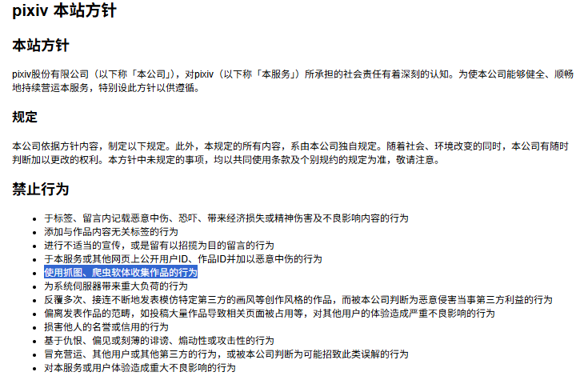

# Pixiv 画师作品批量下载

## 描述

使用 Python 批量下载 Pixiv 用户的插画作品。运行程序后，根据指引输入 **Pixiv 用户** 的 **uid** ，即可自动获取并下载该用户的所有插画作品。


## 安装

本项目使用 `Python 3.13` 开发，使用前需确保 `Python` 已经安装并升级到支持版本。

项目依赖 `requests` 模块运行，如未安装请先于终端运行下列命令：

```
pip install requests
```


## 使用方法

通过终端命令行工具运行 `main.py` 文件即可启动。

```
python main.py
```


首次启动程序后可依据文字指引输入对应内容完成初始配置，如需**重新配置**可运行下列命令：

```
python headers.py
```


配置完成之后即可开始下载，**下载的文件将会保存到 `./Download/PixivUserName` 路径下。**  


## 声明

1. 本程序仅提供下载功能，下载过程中需要确保网络能正确连接到 Pixiv 网站。

2. **下载的作品仅供个人学习使用，详情请遵循 Pixiv 网站的使用方针。对于违反声明不当使用所造成的一切后果由使用者个人承担。**


